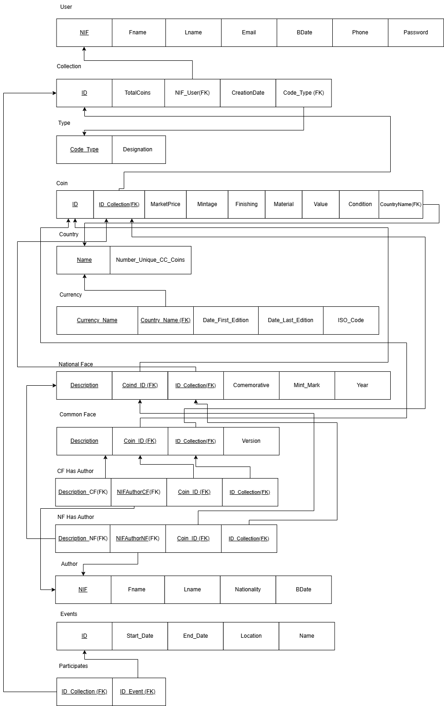
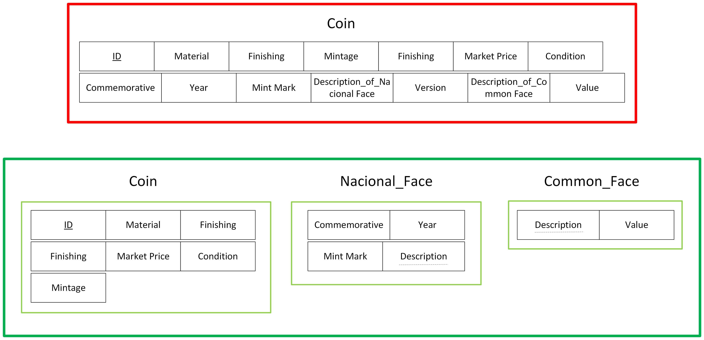
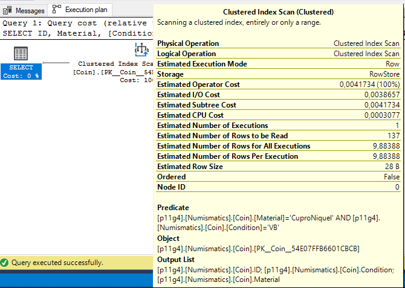
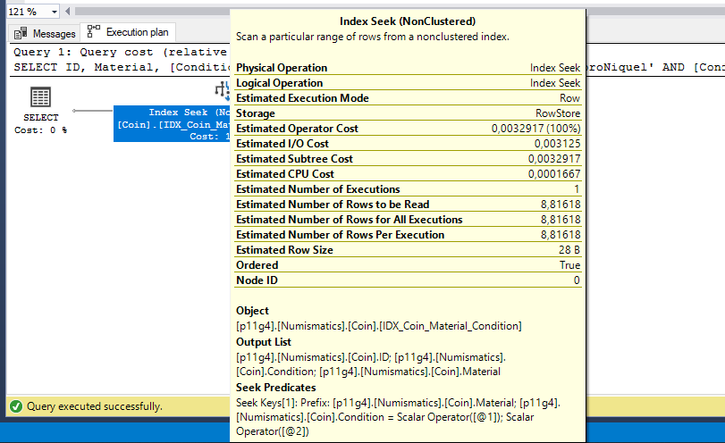
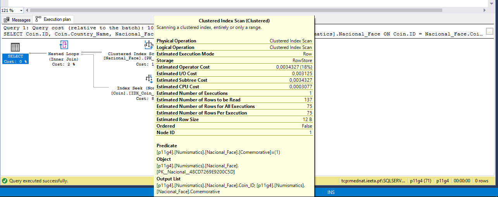
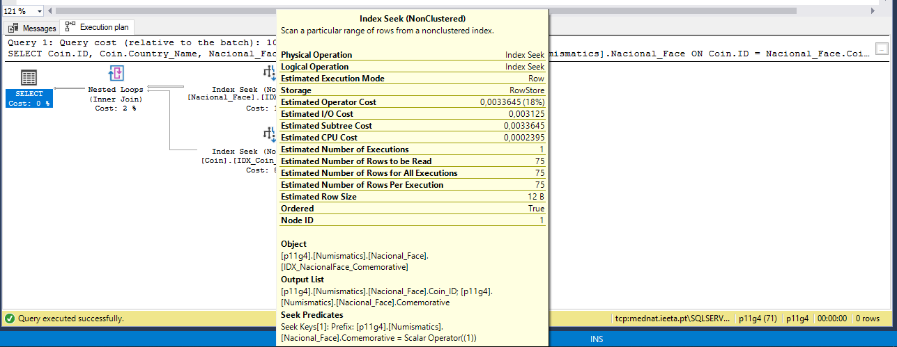

# BD: Trabalho Prático APF-T

**Grupo**: P11G4
- David Pelicano, MEC: 113391
- Hugo Dias, MEC: 114142


## Introdução / Introduction
 
O projeto final de Base de Dados foi desenvolvido com o objetivo de modelar uma base de dados relacional para gestão de coleções de moedas. A estrutura criada permite organizar informações sobre moedas, utilizadores, autores, países, eventos e tipos de coleções, garantindo integridade, normalização e eficiência no armazenamento e consulta dos dados.


## ​Análise de Requisitos / Requirements

## DER - Diagrama Entidade Relacionamento/Entity Relationship Diagram

### Versão final/Final version


### APFE 

Após a primeira entrega, tanto o Diagrama Entidade-Relacionamento (DER) quanto o Modelo Entidade-Relacionamento (ER) foram atualizados.

Uma das principais alterações foi a adição de uma nova tabela denominada Currency. Essa inclusão tornou-se necessária devido à existência de moedas que não se encaixavam no modelo anterior — especificamente moedas antigas que já não são a moeda oficial do país. Para representar essa distinção, foram adicionados os campos de data de início e fim de vigência. A relação entre Country e Currency é do tipo fraca, pois um país pode ter várias moedas ao longo da sua história.

Outra modificação importante foi a inclusão do campo password na entidade User, de modo a viabilizar a implementação de um sistema de login.

Por fim, foram também acrescentados atributos derivados, como o QTY, que representa a quantidade de duplicados de uma determinada moeda.

## ER - Esquema Relacional/Relational Schema

### Versão final/Final Version



### APFE

Após a primeira entrega, tanto o Diagrama Entidade-Relacionamento (DER) quanto o Modelo Entidade-Relacionamento (ER) foram atualizados.

Uma das principais alterações foi a adição de uma nova tabela denominada Currency. Essa inclusão tornou-se necessária devido à existência de moedas que não se encaixavam no modelo anterior — especificamente moedas antigas que já não são a moeda oficial do país. Para representar essa distinção, foram adicionados os campos de data de início e fim de vigência. A relação entre Country e Currency é do tipo fraca, pois um país pode ter várias moedas ao longo da sua história.

Outra modificação importante foi a inclusão do campo password na entidade User, de modo a viabilizar a implementação de um sistema de login.

Por fim, foram também acrescentados atributos derivados, como o QTY, que representa a quantidade de duplicados de uma determinada moeda.

## ​SQL DDL - Data Definition Language

[SQL DDL File](sql/01_ddl.sql "SQLFileQuestion")

## SQL DML - Data Manipulation Language

Nesta secção apresentamos apresentamos as operações desenvolvidas no web site.

### Formulario exemplo/Example Form

```
Exec [dbo].AutoresAmbasFaces 

Exec [dbo].GetCollectionsByNIF 109012345

EXEC dbo.CheckUserParticipation 109012345, 1;

EXEC dbo.ColecoesMaisAntigas;

EXEC dbo.ColecoesMultiplosEventos;

EXEC dbo.ContagemMoedasPorCondicao;

EXEC dbo.ContagemMoedasPorPais;

go

DECLARE @Result BIT;
DECLARE @Message NVARCHAR(255);
DECLARE @CollectionID INT = 6; 

EXEC [dbo].[DeleteCollection]  
    @CollectionID = @CollectionID,
    @Result = @Result OUTPUT,
    @Message = @Message OUTPUT;

SELECT @Result AS Result, @Message AS Message;

go

EXEC dbo.GetAuthorsByNationalityAndEvent 1, 'Portugal';

EXEC dbo.GetAvailableNationalities;

EXEC dbo.GetCoinStatsByConditionInEvents 1; 

EXEC dbo.GetCollectionsByNIF 109012345;

EXEC dbo.GetCommemorativeCoinsByCountryAndEvent 1, 'Portugal';

EXEC dbo.GetCountriesWithCommemorativeCoins;

EXEC dbo.GetEventDetails 1;

EXEC dbo.GetEventParticipants 1;

EXEC dbo.GetMissingCountriesByColection 1; 

EXEC dbo.ListarColecoesPorUser 109012345;

EXEC dbo.ListarEventosFuturos;

EXEC dbo.ListarMoedasPorAno 2022; 

EXEC dbo.ListarMoedasPorCondicao UNC; 

EXEC dbo.ListarMoedasPorMaterial CuproNiquel; 

EXEC dbo.ListarMoedasPorMaterialECondicao CuproNiquel, UNC; 

EXEC dbo.ListarMoedasPorPaisEColecao 1, Portugal;

EXEC dbo.ListarMoedasPorUser 109012345; 

EXEC dbo.ListarMoedasRaras 2001; 

EXEC dbo.ListarUsersEventos ; 

EXEC dbo.MediaValorPorTipo; 

EXEC dbo.MoedasAcimaMediaGlobal;

EXEC dbo.MoedasAntes2008; 

EXEC dbo.MoedasComemorativasPorPaisEColecao Portugal, 1; 

EXEC dbo.MoedasDataErro ; 

EXEC dbo.MoedasDepois2008; 

EXEC dbo.[PaisesComemorativasMultiplas]; 

EXEC dbo.RemoveCoin; 

EXEC dbo.SetUserPassword 109012345, '11'; 

EXEC dbo.Top5ColecoesMaisMoedas; 

EXEC dbo.TopAutoresCF; 

EXEC dbo.TopAutoresNF;

EXEC dbo.TotalMoedasComemorativasPorUser; 

EXEC dbo.ValidateUserLogin 109012345, '11'; 

Exec dbo.Edit_Coin;

Exec dbo.AdicionarMoeda;

Exec GetCoinStatsByCondition 1;

Exec [Numismatics].AddEventWithParticipation ExpoCoins, '2020/12/12', '2020/12/15', Turkey, 109012345, 7

EXec dbo.sp_DecryptPasswordByNIF 123123

Exec [Numismatics].[sp_RegisterUser] 12345678, Hugo, Dias, 'hugo@gmail.com', '12-02-2004', 964323122, hugodias

```


## Normalização/Normalization

O nosso esquema relacional encontra-se na forma normal de Boyce-Codd (BCNF).
Isso significa que, em nenhuma tabela, existem dependências funcionais parciais ou transitivas: todos os atributos dependem unicamente da chave primária da respetiva relação.

Um bom exemplo que evidencia o nível de normalização alcançado é a separação das duas faces das moedas (Common_Face e Nacional_Face) da tabela principal Coin.
Essa abordagem evita a concentração de dados distintos e específicos numa única tabela, promovendo clareza estrutural, modularidade e redução de redundância.



Para garantir que todas as dependências se estabelecem apenas a partir da chave primária, aplicámos várias boas práticas de modelação, tais como:

    - Uso de chaves estrangeiras para representar relações entre entidades sem repetir dados;
    - Adoção de colunas Identity para gerar identificadores únicos de forma automática, assegurando unicidade e facilitando a integridade referencial;
    - Utilização de chaves primárias compostas em tabelas associativas, garantindo a unicidade dos registos compostos e o respeito pelas relações n:m entre entidades.

Estas decisões permitiram-nos construir um modelo eficiente, consistente e escalável, em total conformidade com os princípios da BCNF.

## ​Transações

Relativamente às transações, estas foram aplicadas nos Stored Procedures mais sensíveis, onde a integridade dos dados é crucial e falhas não são toleráveis. Exemplos incluem operações de remoção, adição e edição de moedas e coleções.

O uso de transações garante que essas ações sejam executadas de forma atómica, assegurando que o sistema mantenha consistência mesmo em caso de erro durante a execução.

## ​Login

Como forma de implentar o Login, utilizamos o EncryptByPassPhrase e DecryptByPassPhrase do SQL_Server.

## ​Complexidade

Neste projeto conseguimos implementar querys com bastante complexidade, envolvendo muitas funções de agregação e cláusulas variadas com os diferents joins e orders by ...

## Índices/Indexes

Foram implementados índices com o objetivo de otimizar consultas frequentes sobre as tabelas do banco de dados, com destaque para a tabela Coin.

Todos os índices foram testados e definidos com base na frequência de uso de cada atributo nas cláusulas WHERE e SELECT. A escolha dos campos indexados levou em consideração o volume e o padrão das consultas realizadas.

A seguir, são apresentados testes realizados com dois dos índices implementados. Embora o volume de dados ainda não seja muito elevado — o que pode tornar a diferença de desempenho menos expressiva —, é possível observar melhorias na performance das consultas graças ao uso adequado dos índices.

### Exemplo 1

Before



After  



Como se pode observar nas duas capturas de ecrã apresentadas, é evidente a melhoria no desempenho da consulta ao utilizarmos um índice nonclustered sobre o atributo Collection_ID da tabela Coin.

A implementação deste índice resultou numa redução significativa no custo de CPU, que caiu para praticamente metade. Além disso, o número estimado de linhas por execução também diminuiu de forma considerável, o que contribui diretamente para uma pesquisa mais eficiente e rápida.

### Exemplo 2

Before



After  



Assim como no exemplo anterior, neste caso também é possível observar uma melhoria significativa no custo de CPU ao utilizarmos um índice nonclustered sobre o atributo Commemorative da tabela National_Face.

```sql
CREATE NONCLUSTERED index IX_Coin_ID_Colection 
ON [Numismatics].Coin (ID_Colection);

CREATE NONCLUSTERED INDEX IDX_Coin_Country_Name
ON [Numismatics].Coin (Country_Name);

CREATE NONCLUSTERED INDEX IDX_Coin_Material_Condition
ON [Numismatics].Coin (Material, [Condition]);

CREATE NONCLUSTERED INDEX IDX_Coin_Mintage
ON [Numismatics].Coin (Mintage);

CREATE NONCLUSTERED INDEX IDX_Coin_MarketPrice
ON [Numismatics].Coin (Market_Price);

CREATE NONCLUSTERED INDEX IDX_Coin_Country_Condition
ON [Numismatics].Coin (Country_Name, [Condition]);

CREATE NONCLUSTERED INDEX IDX_Coin_ID_IDColection
ON [Numismatics].Coin (ID, ID_Colection);

CREATE NONCLUSTERED INDEX IDX_Coin_Value_Country
ON [Numismatics].Coin ([Value], Country_Name);

CREATE NONCLUSTERED INDEX IDX_Colection_NIF_User
ON [Numismatics].Colection (NIF_User);

CREATE NONCLUSTERED INDEX IDX_Colection_Creation_Date
ON [Numismatics].Colection (Creation_Date);

CREATE NONCLUSTERED INDEX IDX_Colection_Code_Type
ON [Numismatics].Colection (Code_Type);

CREATE NONCLUSTERED INDEX IDX_User_Fname_Lname
ON [Numismatics].[User] (Fname, Lname);

CREATE NONCLUSTERED INDEX IDX_NacionalFace_Year
ON [Numismatics].Nacional_Face (Year);

CREATE NONCLUSTERED INDEX IDX_NacionalFace_IDColection
ON [Numismatics].Nacional_Face (ID_Colection);

CREATE NONCLUSTERED INDEX IDX_NacionalFace_Comemorative
ON [Numismatics].Nacional_Face (Comemorative);

Create NONCLUSTERED INDEX IDX_Currency_Date_First_Edition
ON [Numismatics].Currency (Date_First_Edition);
```

## SQL Programming: Stored Procedures, Triggers, UDF

[SQL Stored Procedures](sql/02_sp_functions.sql "SQLFileQuestion")

[SQL Triggers](sql/03_triggers.sql "SQLFileQuestion")

[SQL UDFs](sql/06_udfs.sql "SQLFileQuestion")

## Outras notas/Other notes

### Dados iniciais da dabase de dados/Database init data

[SQL DB Init File](sql/04_db_init "SQLFileQuestion")

### Apresentação

[Slides](slides.pdf "Slides")


[Video](VIDEOBDFINAL.mp4)


### Como executar a aplicação

As instruções detalhadas para configurar e executar a aplicação encontram-se no [README dedicado](app/README.md), que inclui:

1. Requisitos do sistema
2. Configuração da base de dados
3. Instalação de dependências
4. Passos para inicialização
5. Solução de problemas comuns


 