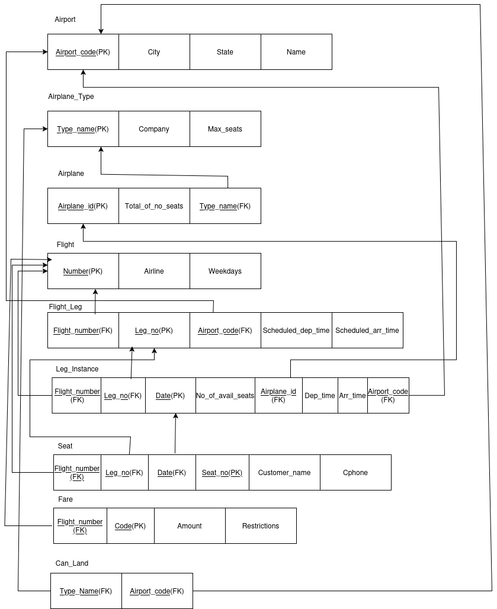
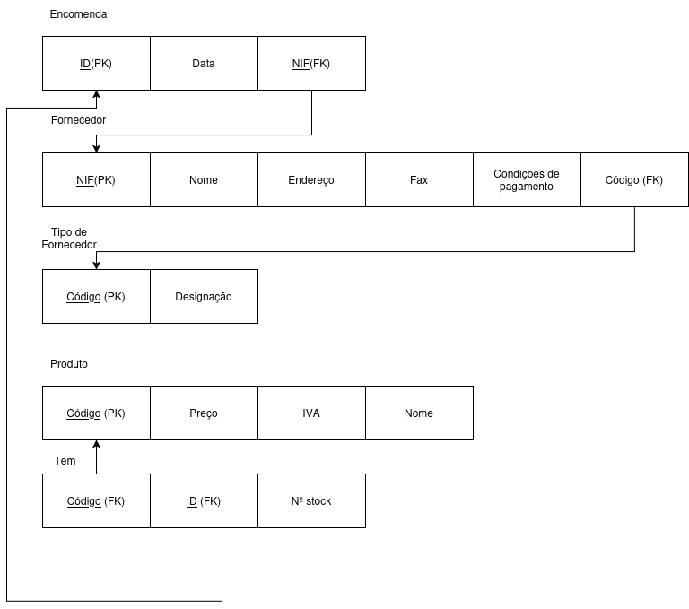
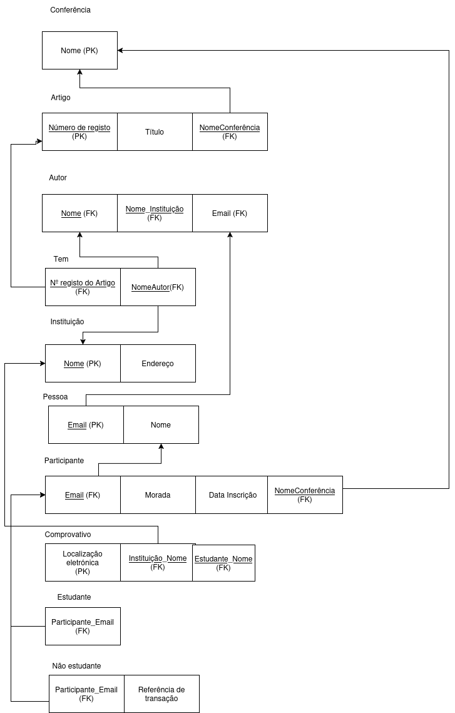

# BD: Guião 3

## ​Problema 3.1

### *a)*

```
Relações:  
            - Aluguer
            - Cliente
            - Balcão
            - Veículo
            - Tipo Veículo
            - Tipo Veículo Similaridade
            - Ligeiro
            - Pesado

r(Aluguer) = Dom(Número) x Dom(Duracao) x Dom(Data) x Dom(NIF) x x Dom(NºBalcao) x Dom(Matricula)
r(Cliente) = Dom(NIF) x Dom(Num_Carta) x Dom(Endereco) x Dom(Nome)
r(Balcão) = Dom(Número) x Dom(Endereco) x Dom(Nome)
r(Veículo) = Dom(Matrícula) x Dom(Ano) x Dom(Marca) x Dom(Código)
r(Tipo Veículo) = Dom(Código) x Dom(Arcondicionado) x Dom(Designacao)
r(Tipo Veículo Similaridade) = Dom(CódigoV1) x Dom(CódigoV2)
r(Ligeiro) = Dom(Código) x Dom(NumLugares) x Dom(Portas) x Dom(Combustível)
r(Ligeiro) = Dom(Código) x Dom(Peso) x Dom(Passageiros)
```

### *b)*

```
Chaves Primárias : Número (Aluguer) / NIF (Cliente) / Número (Balcão) / Matrícula (Veículo) / Código (Tipo Veículo) / CódigoV1+CódigoV2 (Tipo Veículo Similaridade) / Código (Ligeiro) / Código (Pesado)
------------------------------
Chaves Candidatas : Número (Aluguer) / NIF-Num_Carta (Cliente) / Número (Balcão) / Matrícula (Veículo) / Código (Tipo Veículo) / CódigoV1+CódigoV2 (Tipo Veículo Similaridade) / Código (Ligeiro) / Código (Pesado)
------------------------------
Chaves Estrangeiras : NIF-NºBalcao-Matrícula (Aluguer) / Código (Veículo) / CódigoV1-CódigoV2 (Tipo Veículo Similaridade) - Código (Ligeiro) - Código (Pesado)
```

### *c)*


## ​Problema 3.2

### *a)*

```
Airport (Airport_code (PK), City, State, Name)
Airplane_type (Type_name (PK), Company, Max_seats)
Airplane (Airplane_id (PK), Total_no_of_seats, Type_name (PK) )
Flight (Number (PK), Airline, Weekdays)
Flight_leg (Flight_Number (FK), Leg_no (PK), Airport_code(FK), Scheduled_dep_time
, Scheduled_arr_time)
Leg_instance (Flight_Number (FK), Leg_no (FK),Date(PK) No_of_avail_seats, Airplane_id(FK), Dep_time, Arr_time, Airport_code(FK))
Seat (Flight_Number (FK), Leg_no (FK), Date (FK), Seat_no (PK), Customer_name, Cphone)
Fare (Flight_Number (FK), Code (PK), Amount, Restrictions)
Can_land (Type_name (FK), Airport_code (FK))
```

### *b)*

```
Chaves candidadatas:
    Airport -> {Airport_code}
    Airplane_type -> {Type_name}
    Airplane -> {Airplane_id}
    Flight -> {Number}
    Flight_leg -> {Leg_no} 
    Leg_instance -> {Date}
    Seat -> {Seat_no}
    Can_land -> {Type_name, Airport_code}
    Fare -> {Code} 


Chaves primárias:
    Airport -> {Airport_code}
    Airplane_type -> {Type_name}
    Airplane -> {Airplane_id, Type_name}
    Flight -> {Number}
    Flight_leg -> {Flight_Number, Leg_no} 
    Leg_instance -> {Flight_Number, Leg_no, Date}
    Seat -> {Flight_Number, Leg_no, Date, Seat_no}
    Fare -> {Flight_Number, Code} 
    Can_land -> {Type_name, Airport_code}

Chaves estrangeiras:
    Airport -> 
    Airplane_type -> 
    Airplane -> {Type_name}
    Flight -> 
    Flight_leg -> {Airport_code, Flight_Number} 
    Fare -> {Flight_Number} 
    Leg_instance -> {Flight_Number, Leg_no, Airport_code,Airport_id}
    Seat -> {Flight_Number, Leg_no, Date}
    Can_land -> {Type_name, Airport_code}
```

### *c)*



## ​Problema 3.3

### *a)* 2.1



### *b)* 2.2

  

Desenho conceptual alterado (Mudanças a vermelho)  

  

### *c)* 2.3



### *d)* 2.4

  

Desenho conceptual alterado (Mudanças a vermelho)  

  